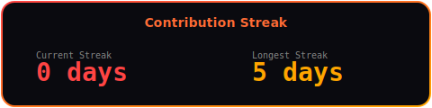

<!-- CYBERPUNK PROFILE - CHARLES-X -->

<!-- HEADER CYBERPUNK -->

<!-- TYPING SUBTITLE -->

 

<!-- SOCIAL LINKS CYBERPUNK -->

 

---

## 🔥 ABOUT ME

<table>
<tr>
<td width="50%" valign="top">

### **Sobre Mi**

Soy **Carlos Alonso Picho Vargas**, conocido como **CHARLES-X**. 

Desarrollador de software apasionado por la **inteligencia artificial**, la **automatizacion** y la **seguridad de redes**.

🚀 **Lo que hago:**
- Full Stack Developer
- AI & Automation Enthusiast
- Network Security Researcher
- Cloud Computing (Azure)
- IoT & Hardware Hacker

💡 **Filosofia:**
> *"Code is poetry, security is art, automation is freedom."*

</td>
<td width="50%" valign="top">

### **About Me**

I'm **Carlos Alonso Picho Vargas**, known as **CHARLES-X**. 

A software developer passionate about **artificial intelligence**, **automation**, and **network security**.

🚀 **What I do:**
- Full Stack Developer
- AI & Automation Enthusiast
- Network Security Researcher
- Cloud Computing (Azure)
- IoT & Hardware Hacker

💡 **Philosophy:**
> *"Code is poetry, security is art, automation is freedom."*

</td>
</tr>
</table>

 

---

## 🛠️ TECH STACK

**Languages**

**Frameworks & Tools**

**Cloud & DevOps**

**AI & Security**

 

---

## 📊 GITHUB STATS

<table align="center">
<tr>
<td colspan="2" align="center">

</td>
</tr>
<tr>
<td align="center">

</td>
<td align="center">

</td>
</tr>
</table>

 

---

## 🐍 CONTRIBUTION SNAKE (CYBERPUNK LAVA)

 

---

## 🚀 CURRENTLY WORKING ON

<table>
<tr>
<td width="50%" valign="top">

### 🔥 Proyectos Activos

- **farmacia-inventario** - Sistema de inventario para farmacia con Laravel 12 (Capstone)
- **trackPays** - Sistema de pagos independiente
- **packet-tracer-mcp-mitm** - Automatizacion de redes Cisco con MCP

</td>
<td width="50%" valign="top">

### 🎯 Próximamente

- **MCP Server Toolkit** - Herramientas MCP para automatización
- **AI Security Lab** - Laboratorio de seguridad con IA
- **Cyberpunk Utils** - Utilidades cyberpunk para desarrolladores

</td>
</tr>
</table>

 

---

## 🏆 FEATURED PROJECTS

<table align="center">
<tr>
<td align="center"></td>
<td align="center"></td>
</tr>
<tr>
<td align="center"></td>
<td align="center"></td>
</tr>
<tr>
<td align="center"></td>
<td align="center"></td>
</tr>
</table>

 

---

## 📈 ACTIVITY GRAPH

 

---

## 🏅 ACHIEVEMENTS & CERTIFICATIONS

| Badge | Description |
|:---:|:---|
|  | AI & Automation Expert |
|  | Network Security Researcher |
|  | Microsoft Azure |
|  | Full Stack Developer |
|  | Mobile Development |
|  | IoT & Hardware |

 

---

## 📊 CODING ACTIVITY

<!-- WakaTime Badge (configurar con tu API key) -->

 

---

## 🎯 GITHUB ACHIEVEMENTS

<!-- Logros de GitHub -->

 

---

## 💬 HOW TO REACH ME

 

---

<!-- FOOTER CYBERPUNK -->

**Made with 🔥 code by CHARLES-X**

